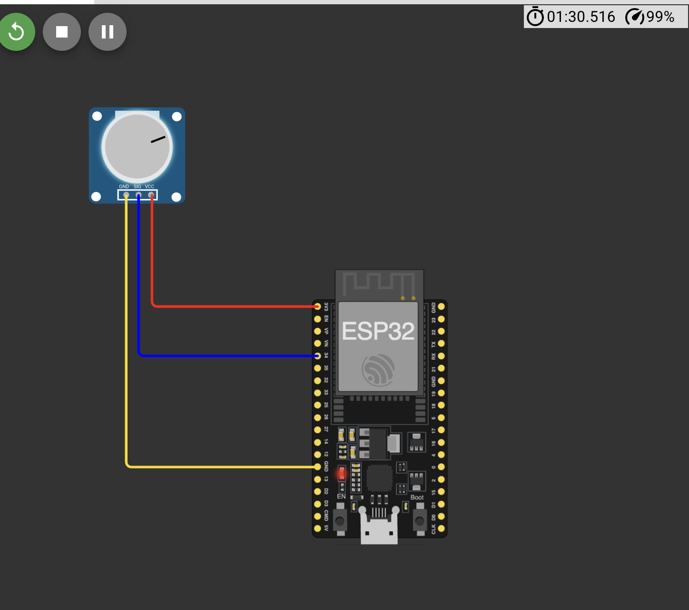
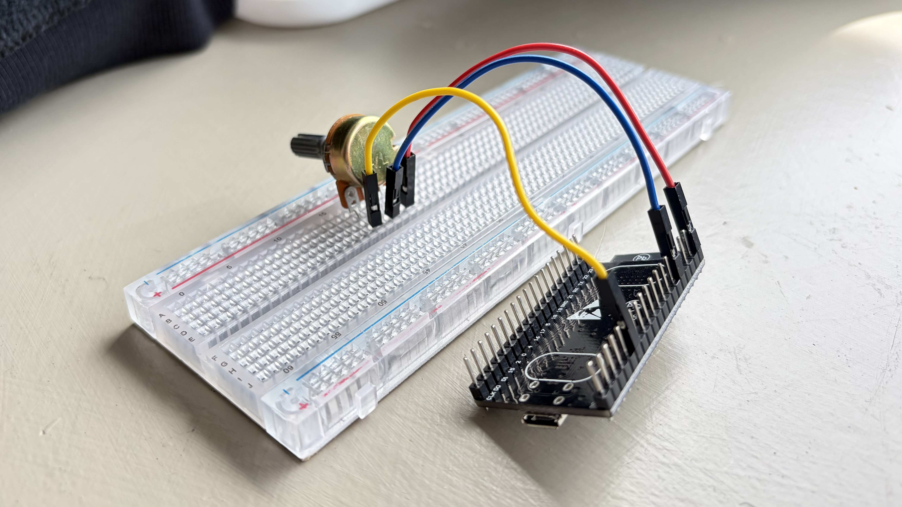
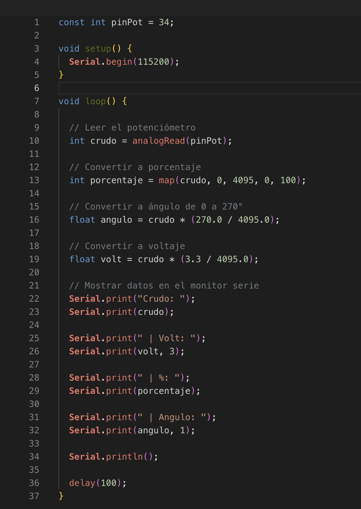

# **Reporte 4: Sensores 101**
**Institución:** Universidad Iberoamericana Puebla  
**Materia:** Introducción a la Mecatrónica  
**Tema:** Sensores 101: ADC & Acondicionamiento

### Lista de Materiales
- ESP32
- Jumpers
- Potenciometro
- Sensor ultrasónico

### Potenciometro y ESP32

*Simulacion*

*Circuito en la vida real*

 *Tabla*
| Punto | Ángulo de referencia | Lectura ADC | Ángulo calculado | Error |
|---|---:|---:|---:|---:|
| Mínimo | 0° | 0 | 0.0° | 0.0° |
| 25% | 67.5° | 1061 | 70.0° | 2.5° |
| 50% | 135° | 2078 | 137.0° | 2.0° |
| 75% | 202.5° | 3094 | 204.0° | 1.5° |
| Máximo | 270° | 4095 | 270.0° | 0.0° |

*Codigo utilizado*

