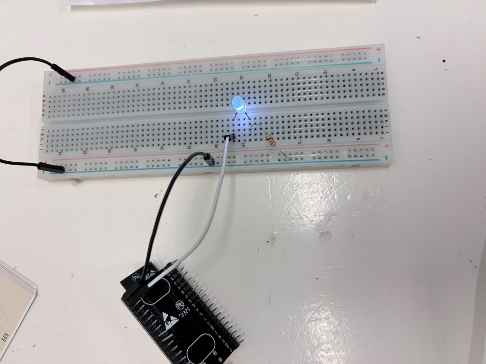

# Reporte de práctica 5: Comunicación Bluetooth
**Institución:** Universidad Iberoamericana Puebla  
**Materia:** Introducción a la Mecatrónica  
**Tema:** Mecanismos 101

## Objetivos
- Enlace Bluetooth: 
    * SerialBT.begin() funcionando, comandos recibidos y mostraados en el Monitor Serial
    * Verificar que el emparejamiento con el celular es estable antes de avanzar 
- LED con bluetooth:
    * Controlar el LED con los comandos ON/OFF desde el celular 
    * Uso correcto de mensaje.trimn(), sin esto la comparación falla
- Protocolo de comando:
    * Documentar la tabla comando --> acción(ON/OFF)

## Materiales
- ESP32 Devkit V1 (1x)
- Cable USB de datos (1x)
- LED (1x)
- Resitencia de 220Ω (1x)
- Protoboard (1x)
- Jumpers 
- Computadora o celular con bluetooth con la app "Serial Bluetooth Terminal"

## Procedimiento
 
 **Código**

*Código en IDE Arduino, probando el comando OFF en el monitor serial.*

*Código en IDE Arduino, probando el comando ON en el monitor serial.*

| Comando (Bluetooth) | Acción en el ESP32 | Estado del LED (Pin 23) |
| ---| --- | --- |
| ON | Pone el LED en HIGH | Encendido |
| OFF | Pone el LED en LOW | Apagado |

**Ensamble**

Armado del circuito en el Protoboard

**Video**
[Video funcionamiento ](../img/bluetooth.MP4)

### Explicación
1. La computadora envia los comandos (ON/OFF) al ESP32. 
2. El microcontrolador recibe el texto y lo limpia con mensaje.trim() donde elimina elementos invisibles que pueden interrumpir con la lectura.
3. En una estructura condicional *if*, se verifica el mensaje, si recibe "ON" se asigna un nivel alto y si recibe "OFF" se asigna un nivel bajo
4. Para que se logre la comunicación inalambrica, en ArduinIDE seleccionamos el puerto COM8 

### Bitacora de fallas
- El programa compilaba correctamente pero el ESP32 no respondia
Pedimos apoyo a la profesora y se identifico que la señal se estaba envviando a COM5(puerto físico), en vez de COM8(puerto inalámbrico)