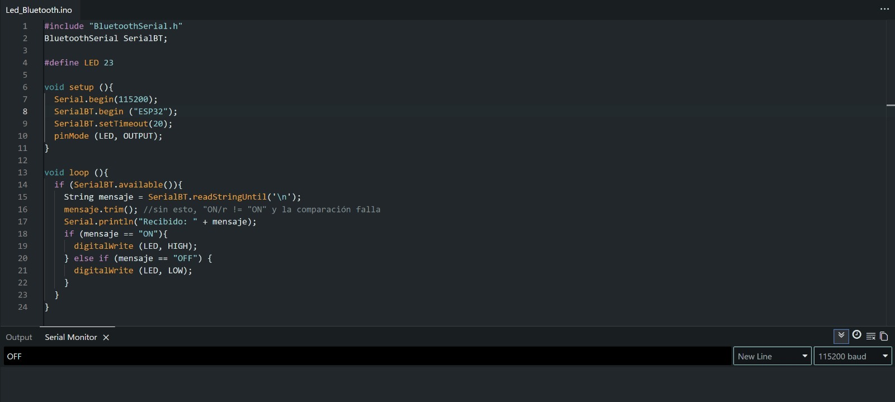

# Reporte de práctica 5: Comunicación Bluetooth
**Institución:** Universidad Iberoamericana Puebla  
**Materia:** Introducción a la Mecatrónica  
**Tema:** Mecanismos 101

### Objetivos
- Enlace Bluetooth: 
    * SerialBT.begin() funcionando, comandos recibidos y mostraados en el Monitor Serial
    * Verificar que el emparejamiento con el celular es estable antes de avanzar 
- LED con bluetooth:
    * Controlar el LED con los comandos ON/OFF desde el celular 
    * Uso correcto de mensaje.trimn(), sin esto la comparación falla
- Protocolo de comando:
    * Documentar la tabla comando --> acción(ON/OFF)

### Materiales
- ESP32 Devkit V1 (1x)
- Cable USB de datos (1x)
- LED (1x)
- Resitencia de 220Ω (1x)
- Protoboard (1x)
- Jumpers 
- Computadora o celular con bluetooth con la app "Serial Bluetooth Terminal"

### Procedimiento
 
 **Código**
  
    
Código en IDE Arduino, probando el comando ON en el monitor serial.

*Código en IDE Arduino, probando el comando OFF en el monitor serial.*